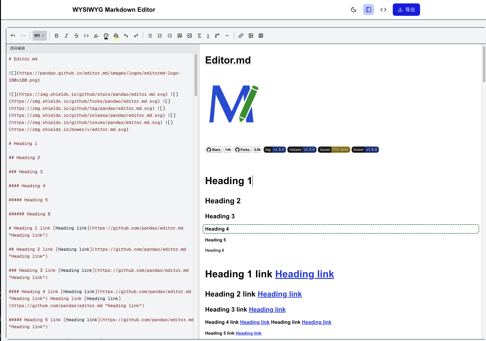
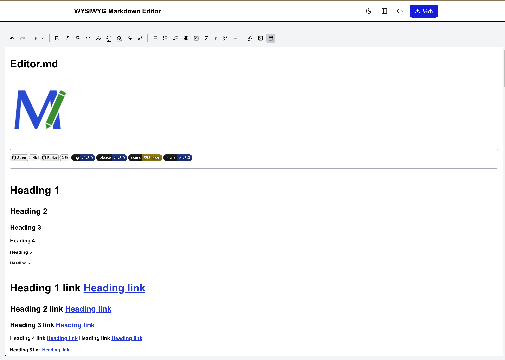
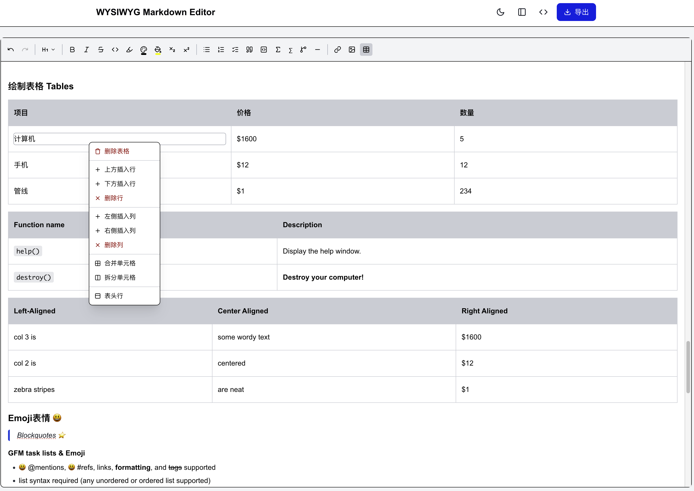
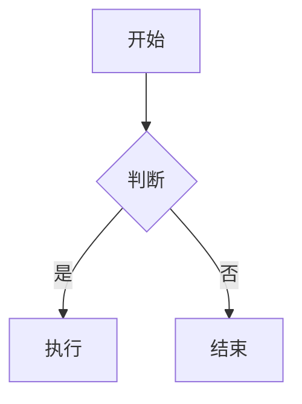

# WYSIWYG Markdown Editor

一个类似 Microsoft Word 的所见即所得 Markdown 编辑器，支持完整的 Markdown 语法。

🌐 **在线示例**：[https://md.tech616.me](https://md.tech616.me)

## 截图



*Light 模式*



*字体颜色选择器*



*Dark 模式*

## 功能特性

- ✅ **实时格式化预览**：输入即所见，无需切换预览模式
- ✅ **完整 Markdown 支持**：标题、列表、表格、代码块、引用等
- ✅ **工具栏快捷操作**：粗体、斜体、删除线、链接、图片、表格等
- ✅ **右键上下文菜单**：表格内右键可进行行列操作
- ✅ **颜色选择器**：字体颜色/背景颜色选择器，支持自定义颜色
- ✅ **多格式导出**：支持导出为 Markdown、HTML、DOCX 格式
- ✅ **快捷键支持**：Ctrl+B 粗体、Ctrl+I 斜体、Ctrl+K 链接等
- ✅ **响应式设计**：支持桌面端和移动端
- ✅ **暗色模式**：支持亮色/暗色主题切换
- ✅ **Emoji 支持**：支持 `:smiley:` 等 GFM 表情短码
- ✅ **KaTeX 公式**：支持行内和块级 LaTeX 公式
- ✅ **Mermaid 图表**：支持流程图、时序图等

## 技术栈

- **框架**：Next.js 16 (App Router)
- **编辑器**：Tiptap (基于 ProseMirror)
- **样式**：Tailwind CSS v4
- **导出**：html-to-docx, file-saver
- **语法高亮**：lowlight + highlight.js
- **图表**：Mermaid
- **公式**：KaTeX
- **Emoji**：node-emoji

## 快速开始

### 本地开发

```bash
# 进入项目目录
cd markdown_visual_editor

# 安装依赖
npm install

# 启动开发服务器
npm run dev
```

打开 [http://localhost:3000](http://localhost:3000) 访问编辑器。

### 构建生产版本

```bash
npm run build
npm run start
```

## Docker 部署

项目根目录包含 Docker 和 Docker Compose 配置。

### 前置条件

- Docker & Docker Compose

### 使用 Docker Compose（推荐）

```bash
# 在项目根目录（包含 docker-compose.yml）
docker compose up -d
```

访问 [http://localhost:3003](http://localhost:3003)。

### 自定义端口

创建 `.env` 文件（基于 `.env.example`）：

```bash
# .env
PORT=8080
```

然后启动：

```bash
docker compose up -d
```

访问 [http://localhost:8080](http://localhost:8080)。

### 使用 Docker 直接构建

```bash
docker build -t markdown-editor markdown_visual_editor
docker run -p 3003:3000 markdown-editor
```

## 使用说明

### 编辑器操作

1. **输入内容**：直接在编辑器中输入文字
2. **格式化**：使用工具栏按钮或快捷键
3. **插入元素**：点击工具栏的插入按钮
4. **表格操作**：光标在表格内时，表格按钮变为表格操作菜单，或在表格内右键
5. **导出**：点击右上角的"导出"按钮选择格式

### 支持的 Markdown 语法

#### 标题
```
# 标题 1
## 标题 2
### 标题 3
#### 标题 4
##### 标题 5
###### 标题 6
```

#### 字符格式
```
**粗体**
*斜体*
~~删除线~~
`行内代码`
==高亮==
```

#### 列表
```
- 无序列表项 1
- 无序列表项 2

1. 有序列表项 1
2. 有序列表项 2

- [ ] 任务列表项 1
- [x] 任务列表项 2
```

#### 块级元素
```
> 引用块

---

代码块
```

#### 表格
```
| 表头 1 | 表头 2 |
|--------|--------|
| 内容 1 | 内容 2 |
```

#### 链接和图片
```
[链接文本](https://example.com)

```

#### Emoji
```
:smiley: :star: :rocket: :+1:
```

#### LaTeX 公式
```
行内公式 $E=mc^2$

块级公式 $$ \int_a^b x^2 dx $$
```

#### Mermaid 图表
````

````

### 快捷键

| 快捷键 | 功能 |
|--------|------|
| Ctrl+B | 粗体 |
| Ctrl+I | 斜体 |
| Ctrl+K | 插入链接 |
| Ctrl+Shift+X | 删除线 |
| Ctrl+Shift+H | 高亮 |
| Ctrl+Z | 撤销 |
| Ctrl+Shift+Z | 重做 |

## 项目结构

```
markdown_editor/
├── docker-compose.yml           # Docker Compose 配置
├── .env.example                 # 环境变量示例
├── article_example.md           # 示例文章
└── markdown_visual_editor/      # 编辑器应用
    ├── Dockerfile               # Docker 构建文件
    ├── public/
    │   ├── screenshot1.png      # 截图
    │   ├── screenshot2.png      # 截图
    │   └── screenshot3.png      # 截图
    ├── src/
    │   ├── app/
    │   │   ├── page.tsx         # 主页面
    │   │   ├── layout.tsx       # 布局组件
    │   │   └── globals.css      # 全局样式
    │   ├── components/
    │   │   └── editor/
    │   │       ├── extensions.ts        # Tiptap 扩展配置
    │   │       ├── toolbar.tsx          # 工具栏组件
    │   │       ├── wysiwyg-editor.tsx   # 编辑器主组件
    │   │       ├── color-picker-panel.tsx  # 颜色选择器
    │   │       ├── code-block-node-view.tsx  # 代码块视图
    │   │       ├── mermaid-node-view.tsx    # Mermaid 图表视图
    │   │       └── ...
    │   ├── lib/
    │   │   ├── export.ts        # 导出功能
    │   │   └── markdown-migrate.ts  # Markdown 迁移
    │   └── styles/
    │       └── editor.css       # 编辑器样式
    ├── package.json
    └── README.md
```

## 导出功能

### Markdown 导出
- 将编辑器内容转换为标准 Markdown 格式
- 保留所有格式和结构

### HTML 导出
- 生成完整的 HTML 文件
- 包含内联样式，可直接在浏览器中打开

### DOCX 导出
- 生成 Word 文档格式
- 支持基本的格式和样式

## 开发说明

### 添加新功能

1. 在 `src/components/editor/extensions.ts` 中添加新的 Tiptap 扩展
2. 在 `src/components/editor/toolbar.tsx` 中添加对应的工具栏按钮
3. 在 `src/styles/editor.css` 中添加相应的样式

### 自定义样式

编辑 `src/styles/editor.css` 文件来自定义编辑器样式。

### 添加新的导出格式

在 `src/lib/export.ts` 中添加新的导出函数。

## 许可证

MIT License
